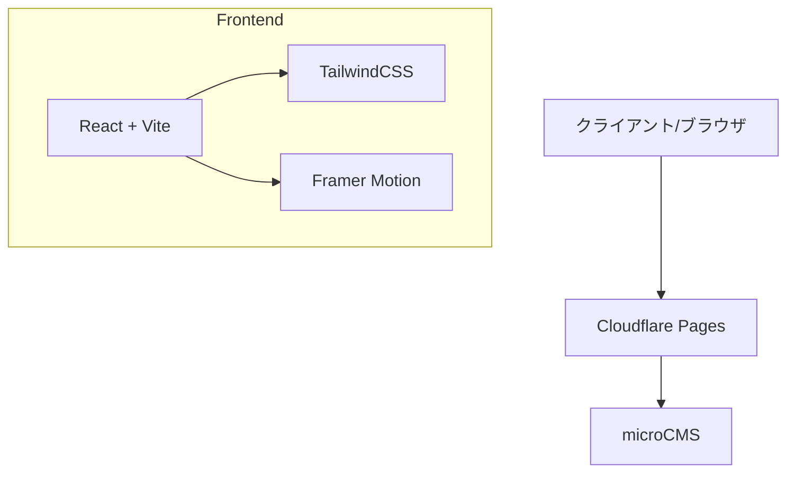

# モノクロームデザイン個人サイト システムアーキテクチャ設計書
Version 1.0.0 (2024/03/08)

## 1. システム構成図



## 2. 環境構築手順

### 2.1 開発環境セットアップ
```bash
npm create vite@latest my-portfolio -- --template react-ts
cd my-portfolio
npm install @tanstack/react-query next-themes wouter framer-motion lucide-react class-variance-authority clsx tailwind-merge
```
...