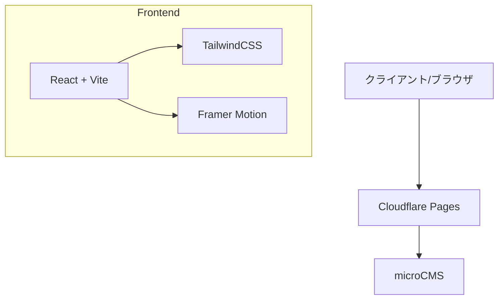

# モノクロームデザイン個人サイト システムアーキテクチャ設計書
Version 1.0.1 (2024/03/08)

## 1. システム構成図



## 2. 環境構築手順

### 2.1 開発環境セットアップ
```bash
npm create vite@latest my-portfolio -- --template react-ts
cd my-portfolio
npm install @tanstack/react-query next-themes wouter framer-motion lucide-react class-variance-authority clsx tailwind-merge
```

### 2.2 MicroCMS設定 (今後の実装予定)
1. ブログ用のAPIスキーマ設定
   - タイトル (テキストフィールド)
   - 本文 (リッチエディタ)
   - サムネイル (画像)
   - カテゴリ (セレクトフィールド)
   - 公開日 (日時)

2. APIエンドポイント設計
   - GET /api/blog : ブログ記事一覧の取得
   - GET /api/blog/:id : 個別記事の取得

3. 必要なページコンポーネント
   - BlogList.tsx : 記事一覧ページ
   - BlogPost.tsx : 記事詳細ページ

### 2.3 Cloudflare Pages設定
1. GitHubリポジトリとの連携
2. ビルド設定
   - フレームワークプリセット: Vite
   - ビルドコマンド: npm run build
   - ビルド出力ディレクトリ: dist
3. カスタムドメイン(majalis.site)の設定
   - DNSレコードの追加
   - SSLの有効化